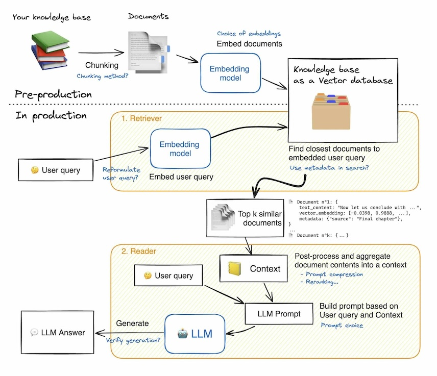

# RAG Application with Weights and Biases

## QA Application Overview

For a RAG application we need the following:

There are two main phases:
* **Data Preparation:** 
   1. Gather documents from data sources
   2. Extract and prepare documents
   3. Chunk documents in smaller sections
   4. Embed chunks of documents and store them for quick retrieval in a vector store

* **Inference:**
   1. Embed a user query and perform similarity search agains vector index
   2. Insert retrieved context and user question into LLM prompt template and query
   3. Present or post-process the answer

